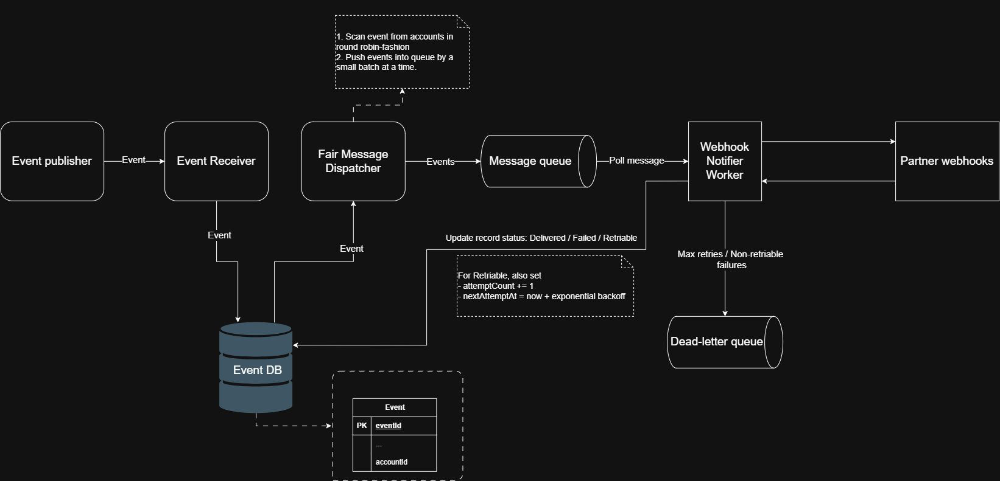

# Webhook Notifier System Design

## 1. Context and Scope

This document describes the company's webhook notification pipeline. Registration and configuration of upstream webhooks are handled outside this system. The upstream event contract is used only as the reference for incoming event shapes.

The proof of concept will run locally with Go, Docker Compose, PostgreSQL, and RabbitMQ.

The system must provide:

- Fair processing across company accounts.
- Independent horizontal scaling of the receiver, dispatcher, and workers.
- Durable event handling with bounded retries and dead-letter processing.

Security hardening is outside the scope of this proof of concept.

## 2. Current Flow

The system consists of the following high-level components:

1. **Event publisher**: Upstream system sending webhook events.
2. **Event receiver**: Accepts events via HTTP and persists them durably.
3. **Event DB**: Persistent store for event records, delivery states, and retry metadata.
4. **Fair message dispatcher**: Scans events per account in round-robin order and publishes work to the queue.
5. **Message queue**: Buffers work and manages delivery to workers.
6. **Webhook notifier worker**: Consumes messages, delivers payloads to partner endpoints, and handles retries.
7. **Partner webhook**: External endpoints receiving final notifications.
8. **Dead-letter queue (DLQ)**: Sink for terminal delivery failures.

## 3. Event and Ingestion Contract

The event publisher supplies all necessary routing and deduplication metadata along with the event payload in the HTTP request:

- `account_id`: Identifies the tenant account for fair scheduling.
- `destination_url`: The destination endpoint URL where the webhook must be delivered.
- `idempotency_key`: A unique key per event instance supplied by the caller (or `Idempotency-Key` header) to ensure idempotent ingestion. Note that `webhook_id` identifies the subscription endpoint and cannot be used as an idempotency key because one webhook receives many events over time.
- `payload`: The structured webhook event payload.

## 4. Fairness Design

### Problem

An account with millions of events must not occupy the queue with its entire backlog and delay accounts with only a few events.

### Design

The dispatcher uses two controls together:

1. **Per-account quantum**: During one scheduling turn, an account can contribute only a small fixed number of events, such as one to five.
2. **Queue backpressure**: The dispatcher stops claiming new events when RabbitMQ reaches a configured high-water mark or when the number of in-flight events reaches its limit. It resumes when the queue falls below a low-water mark.

The dispatcher rotates through accounts with pending events in round-robin order. Within each account's turn, events are claimed in FIFO order by arrival timestamp (`ORDER BY created_at ASC`), ensuring earliest arrived events are dispatched first. A new batch should not be triggered only because the queue is nearly empty: queue depth alone does not prevent a large account from refilling it. The per-account quantum is the fairness control; the queue watermarks are the capacity control.

For horizontally scaled dispatchers, event claiming must use PostgreSQL leases and row locking. The POC should use one active scheduler with lease-based failover, or explicitly partition account ownership. Multiple independent schedulers must not each scan and publish the same account backlog.

## 5. Reliability Design

### 5.1 Durable acceptance

The receiver writes the event to PostgreSQL before returning success. The insert is idempotent based on `(account_id, idempotency_key)` so repeated deliveries do not create duplicate records.

Each event stores at least:

- Event ID and caller-supplied `idempotency_key`
- `account_id` and `destination_url`
- `webhook_id` and original event payload
- Current status (`pending`, `published`, `delivered`, `retriable`, `dead_letter`)
- Attempt count and max attempts
- Next retry time (`next_retry_at`)
- Lease owner and lease expiry
- Last failure reason
- Created and updated timestamps

### 5.2 Dispatcher to RabbitMQ and Retry Handling

The Fair Dispatcher handles both newly received events (`pending`) and due retries (`retriable` with `next_retry_at <= now()`). It selects work per account in round-robin order, claims records using short leases, publishes them with RabbitMQ publisher confirms, and marks them `published`. Unifying retry dispatch into the fair dispatcher ensures retries also respect account fairness and queue capacity without requiring a separate scheduler process.

The system prefers duplicate publication over event loss. Workers therefore process messages idempotently.

### 5.3 Worker to partner webhook

Retries belong primarily at the external delivery boundary, where the worker can classify the partner response:

- `2xx`: delivery succeeded; persist delivered state and acknowledge the RabbitMQ message.
- Timeout, connection error, `429`, or `5xx`: retry with exponential backoff and jitter.
- Permanent `4xx` or invalid configuration: do not retry indefinitely; move the event to the dead-letter state.

The retry is not a blocking sleep inside the worker loop. On a retryable failure, the worker persists the event as retriable with `next_attempt_at = now + backoff`, then continues processing other messages. The result is at-least-once delivery with bounded retry latency and no worker-idle backoff behavior.

The worker uses a request timeout and manual RabbitMQ acknowledgements. It acknowledges a message only after the event state has been durably updated.

### 5.4 Dead letters

After the maximum retry count or retry window is reached:

1. Persist the terminal failure and original payload in PostgreSQL.
2. Publish an operator-visible message to a RabbitMQ dead-letter queue.
3. Expose the event's attempts, timestamps, destination, and failure reason for inspection.

For this implementation, the dead-letter queue is receive-only. Replay and automated DLQ processing are outside the scope of the POC. Events remain available for inspection together with their original payload and terminal failure information.

## 6. Scaling Model

Each role can scale independently:

- **Event receivers**: Multiple stateless HTTP instances behind the local entry point. PostgreSQL idempotency prevents duplicate logical events.
- **Fair dispatcher**: A single active scheduler with lease-based failover for the POC. A later version can partition account ownership.
- **Workers**: Multiple RabbitMQ consumers with configurable concurrency. Worker count can increase independently of receiver and dispatcher count.
- **PostgreSQL and RabbitMQ**: Run as Docker Compose services for the local POC.

The queue is a buffer, not the fairness mechanism. Fairness must be enforced before publishing messages to RabbitMQ.

## 7. Testing and Benchmarking

### 7.1 Event Publisher Simulation and Web Dashboard

The POC includes a local Event Publisher Simulator to generate realistic multi-account traffic and validate the pipeline end-to-end without external dependencies. It includes an embedded Web Dashboard served locally (e.g. `http://localhost:8084`) for interactive scenario configuration, real-time metrics observation, and live fairness visualization, alongside a scriptable CLI interface.

The simulator is fully configurable and supports:

- **Interactive Web UI**: Web interface to select traffic profiles, adjust rates, trigger runs, and observe live per-account delivery charts, queue depth, and retry counters.
- **Multiple event types**: Sending all defined event shapes with configurable proportions.
- **Multi-webhook accounts**: Simulating single accounts with multiple distinct webhooks pointing to different destination URLs.
- **Configurable traffic parameters**: Total event count, target rate (events/sec), concurrency, burst sizes, and mock partner error rates (200, 429, 500, timeout, 404).
- **Traffic profiles**:
  - **Balanced**: Accounts publishing at comparable rates.
  - **Noisy neighbor**: One high-volume account producing a massive backlog alongside low-volume accounts.
  - **Burst**: Periodic high-intensity event bursts.
  - **Duplicate**: Intentionally re-sending identical `(account_id, idempotency_key)` pairs.
  - **Invalid**: Malformed payloads to verify receiver validation and error handling.

The simulator records acceptance status, response latency, accepted/rejected counts, and duplicate detection rates.

### 7.2 Benchmark Metrics and Scenarios

The benchmark measures system capacity, fairness, and reliability:

- Receiver acceptance throughput and latency (p50, p95, p99).
- Per-account delivery latency and throughput share under noisy-neighbor conditions.
- RabbitMQ queue depth (ready vs unacknowledged) and backpressure responsiveness.
- Dispatcher batch sizes and round-robin account interleaving.
- Retry attempts, backoff intervals, and DLQ terminal failure transitions.
- Resource usage (CPU, memory) across services.

The primary validation benchmark subjects the system to a dominant account with millions of events alongside active smaller accounts. The test succeeds when small accounts maintain bounded dispatch latency, queue watermarks throttle the dominant account, and all transient failures follow exponential retry backoff without idling workers.

